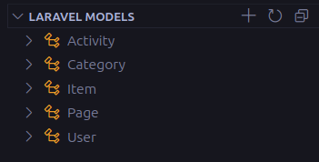
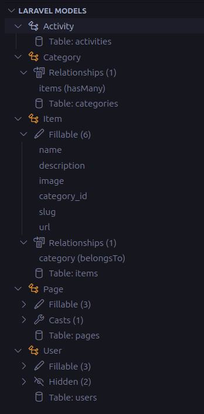

# Laravel Models Explorer

[](https://marketplace.visualstudio.com/items?itemName=laravel-models-explorer)
[](LICENSE)
[](https://marketplace.visualstudio.com/items?itemName=IvanMercedes.laravel-models-explorer)

A powerful Visual Studio Code extension that provides an intuitive tree view to explore and manage all Laravel Eloquent models in your project. Navigate through your models, view their properties, relationships, and more with ease.

## ✨ Features

- **🔍 Automatic Laravel Detection** - Automatically detects Laravel projects and activates the extension
- **📁 Models Tree View** - Clean, organized sidebar showing all your Eloquent models
- **🔗 Model Analysis** - Extracts and displays model properties:
  - Fillable attributes
  - Hidden attributes
  - Cast definitions
  - Eloquent relationships
  - Used traits
  - Database table names
- **⚡ Quick Navigation** - Click any model to instantly open the file
- **➕ Model Creation** - Create new models with boilerplate code directly from the extension
- **🔄 Auto-refresh** - Automatically updates when model files are added, modified, or deleted
- **💡 Rich Information** - Detailed tooltips and expandable nodes with model metadata
- **🎨 Beautiful Icons** - Contextual icons for different model elements

## 🚀 Quick Start

1. **Install the extension** from the VS Code Marketplace
2. **Open a Laravel project** in VS Code
3. **Look for "Laravel Models"** in the Explorer sidebar
4. **Click on any model** to open the file and start exploring!

## 📸 Screenshots

### Models Overview



### Model Details




## 🛠️ Installation

### From VS Code Marketplace

1. Open VS Code
2. Go to Extensions (`Ctrl+Shift+X` / `Cmd+Shift+X`)
3. Search for "Laravel Models Explorer"
4. Click **Install**

### From Command Line

```bash
code --install-extension laravel-models-explorer
```

## 📋 Requirements

- **VS Code** version 1.74.0 or higher
- **Laravel project** with `composer.json`
- **Models** in `app/Models/`

## 🎯 Usage

### Exploring Models

- The extension automatically scans your Laravel project for Eloquent models
- Models appear in the "Laravel Models" tree view in the Explorer sidebar
- Expand any model to see its detailed information

### Model Information Display

Each model shows:

- **Fillable Fields** - Mass assignable attributes
- **Hidden Fields** - Attributes hidden from arrays/JSON
- **Casts** - Attribute casting definitions
- **Relationships** - Eloquent relationships (hasOne, hasMany, belongsTo, etc.)
- **Table Name** - Database table (auto-detected or custom)
- **Traits** - Used traits like HasFactory

### Creating New Models

1. Click the **+** icon in the Laravel Models panel
2. Enter the model name (e.g., "Post", "Category")
3. The extension creates a new model file with Laravel boilerplate
4. The file opens automatically for editing

### Navigation

- **Single click** on a model to open the file
- **Expand/collapse** nodes to explore model details
- Use the **refresh** button to manually update the tree

## ⚙️ Extension Settings

This extension contributes the following settings:

| Setting                         | Description                             | Default |
| ------------------------------- | --------------------------------------- | ------- |
| `laravelModels.autoRefresh`     | Automatically refresh when files change | `true`  |
| `laravelModels.showProjectInfo` | Display Laravel version in tree         | `true`  |
| `laravelModels.expandByDefault` | Expand model nodes by default           | `false` |

## 🎨 Customization

### Icons and Themes

The extension uses VS Code's built-in theme icons and adapts to your current theme automatically.

### File Watching

The extension automatically watches for changes in:

- `app/Models/**/*.php`

## 📝 Commands

| Command                        | Description                      | Keybinding |
| ------------------------------ | -------------------------------- | ---------- |
| `Laravel Models: Refresh`      | Manually refresh the models tree | -          |
| `Laravel Models: Create Model` | Create a new Eloquent model      | -          |
| `Laravel Models: Open Model`   | Open selected model file         | -          |

## 🔧 Supported Laravel Versions

- ✅ Laravel 11.x
- ✅ Laravel 10.x
- ✅ Laravel 9.x
- ✅ Laravel 8.x

## 🐛 Known Issues

- Models with complex inheritance might not be fully analyzed
- Custom model paths outside `app/Models` directory are not automatically detected
- Some dynamic relationships might not be recognized


### Development Setup

```bash
# Clone the repository
git clone https://github.com/ivanmercedes/laravel-models-explorer.git

# Install dependencies
npm install

# Open in VS Code
code .

# Press F5 to run the extension in a new Extension Development Host window
```

### Building

```bash
# Compile TypeScript
npm run compile

# Watch for changes
npm run watch

# Package extension
vsce package
```

## 📄 License

This extension is licensed under the [MIT License](LICENSE).

## 🙏 Acknowledgments

- Thanks to the Laravel community for inspiration
- Built with ❤️ for Laravel developers
- Icons provided by VS Code's Codicon library

## 📞 Support

- 🐛 **Bug Reports**: [GitHub Issues](https://github.com/ivanmercedes/laravel-models-explorer/issues)
- 💡 **Feature Requests**: [GitHub Discussions](https://github.com/ivanmercedes/laravel-models-explorer/discussions)
- ⭐ **Rate the Extension**: [VS Code Marketplace](https://marketplace.visualstudio.com/items?itemName=IvanMercedes.laravel-models-explorer)


## 📈 Changelog

### [1.0.0] - 2025-06-07

- 🎉 Initial release
- ✨ Laravel project detection
- 📁 Models tree view
- 🔍 Model analysis and information display
- ➕ Model creation functionality
- 🔄 Auto-refresh capabilities

---

**Enjoy exploring your Laravel models!** 🚀

If you find this extension helpful, please consider:

- ⭐ **Rating it** on the VS Code Marketplace
- 🐛 **Reporting issues** on GitHub
- 💡 **Suggesting features** for future versions
- 📢 **Sharing it** with other Laravel developers
